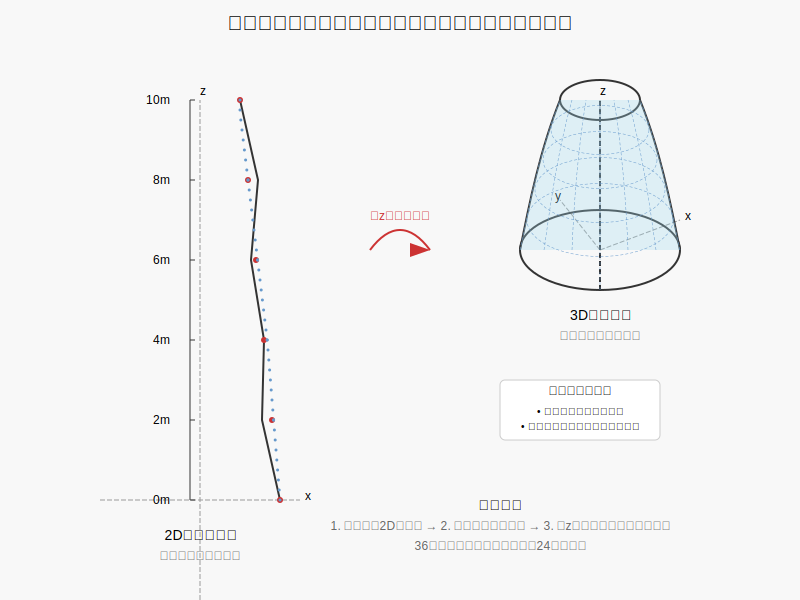

# 案例4：桥梁路灯结构分析（Lamp on the Bridge）

## 概述

本案例展示了如何使用OpenSeesPy和GMSH结合进行桥梁路灯结构的模态分析。路灯结构由薄壳单元组成，通过壳单元模拟灯杆和灯头，在顶部连接一个质量点模拟灯具。



## 文件说明

- street_light_surface_mesh.py: 创建路灯几何模型并生成GMSH网格
- street_light_shell_demo.py: 使用OpenSeesPy进行有限元建模和模态分析
- street_light.msh: 生成的路灯网格文件
- lamp-surface-svg.svg: 路灯结构示意图
- tower_mesh.py: 创建塔架网格模型（Opstool例子）
- forma11c_profile.json: 塔架几何模型的坐标数据

## 技术要点

- 使用GMSH创建曲线和曲面几何体
- 薄壳单元建模与网格划分技术
- OpenSeesPy模态分析
- 刚性连接（`rigidLink`）的应用
- 质量点模拟和约束条件设置

## 操作步骤

### 1. 创建路灯网格模型

运行以下命令生成路灯的GMSH网格模型：

```python
python street_light_surface_mesh.py
```

这将创建一个包含以下特征的路灯模型：
- 总高度约9.0米
- 水平伸出段长度约1.0米
- 灯杆底部半径0.09米，顶部半径0.03米
- 曲线部分采用圆弧过渡

生成的网格文件将保存为street_light.msh。

### 2. 执行模态分析

运行以下命令执行路灯结构的模态分析：

```python
python street_light_shell_demo.py
```

这将执行以下操作：
1. 读取GMSH网格文件
2. 设置材料参数（钢材：E=2.06e11 Pa, ν=0.3, ρ=7850 kg/m³）
3. 创建薄板纤维截面（厚度为4mm）
4. 定义底部固定约束
5. 在顶部连接30kg的质量点模拟灯具
6. 进行模态分析
7. 显示模型和模态振型

### 3. 结果分析

模态分析结果将显示路灯结构的固有频率和振型。程序会自动输出关键模态频率，并可视化模态振型。

特别注意以下模态：
- 第1阶模态：基本弯曲振动
- 第47和48阶模态：高阶振动模式
- 第60阶模态：综合振动模式

## 模型参数修改

如需修改模型参数，可编辑以下文件：

1. street_light_surface_mesh.py中的以下参数：
   - `height`：路灯总高度
   - `horizontal_length`：水平伸出段长度
   - `base_radius`和`top_radius`：灯杆底部和顶部半径
   - `num_sections`和`num_circle_points`：控制网格精度

2. street_light_shell_demo.py中的以下参数：
   - 材料参数：`E`、`nu`、`rho`
   - 壳单元厚度：修改`ops.section("PlateFiber", secTag, 1, 0.004)`中的0.004值
   - 灯具质量：修改`ops.mass(light_tag, 30,30,30,0,0,0)`中的质量值

## 注意事项

- 确保已正确安装OpenSeesPy、opstool和GMSH
- 网格生成可能需要较长时间，取决于计算机性能
- 可视化需要PyVista支持

## 延伸学习

- 尝试修改路灯几何参数，观察模态特性的变化
- 对模型施加不同的动力荷载，如风荷载或地震荷载
- 对不同厚度和材料的路灯进行对比分析