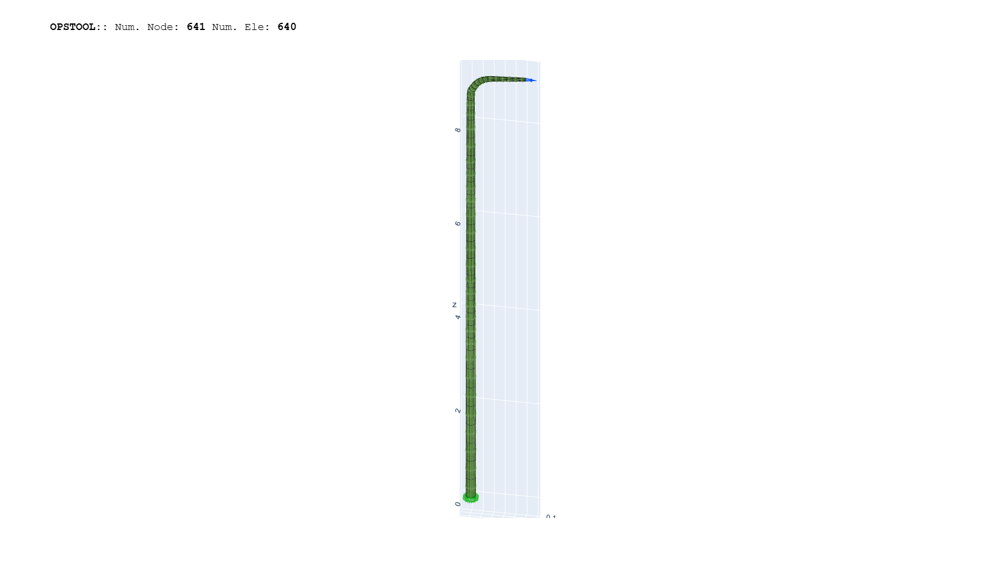
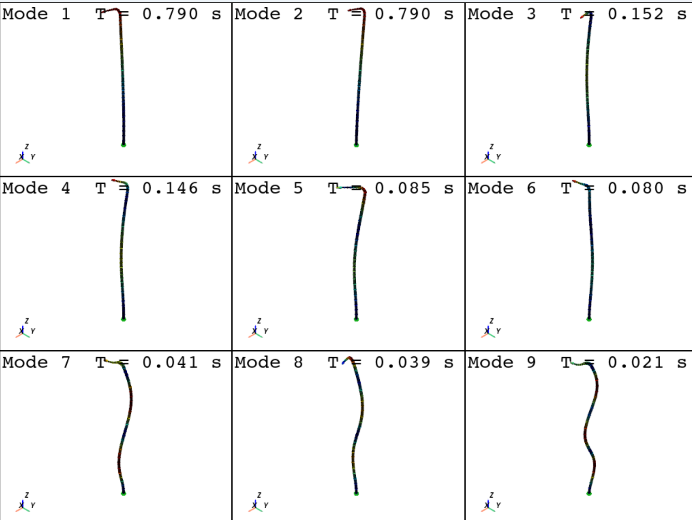

# 案例4：桥梁路灯结构分析（Lamp on the Bridge）

## 概述

本案例展示了如何使用OpenSeesPy和GMSH结合进行桥梁路灯结构的模态分析。路灯结构由薄壳单元组成，通过壳单元模拟灯杆和灯头，在顶部连接一个质量点模拟灯具。

## 路灯模型截图
交互式显示请打开[model](./street_light_model.html)


## 路灯振型截图
交互式显示请打开[eigen](./street_light_eigen.html)


## 节点变形动画


## 文件说明

- street_light_surface_mesh.py: 创建路灯几何模型并生成GMSH网格
- street_light_shell_demo.py: 使用OpenSeesPy进行有限元建模和模态分析
- street_light.msh: 生成的路灯网格文件
- street_light_model.html: 路灯模型的交互式显示
- street_light_eigen.html: 路灯振型的交互式显示
- NodalRespAnimation.gif: 节点变形动画

## 技术要点

- 使用GMSH创建曲线和曲面几何体
- 质量点模拟和约束条件设置

## 操作步骤

### 1. 创建路灯网格模型

运行以下命令生成路灯的GMSH网格模型：

```python
python street_light_surface_mesh.py
```

这将创建一个包含以下特征的路灯模型：
- 总高度约9.0米
- 水平伸出段长度约1.0米
- 灯杆底部半径0.09米，顶部半径0.03米
- 曲线部分采用圆弧过渡

生成的网格文件将保存为street_light.msh。

### 2. gmsh转换到openseespy模型并进行静载，模态分析，地震荷载分析

打开[street_light_shell_demo](./street_light_shell_demo.ipynb)按顺序执行即可

这个脚本包含以下操作：
1. 读取GMSH网格文件
2. 设置材料参数（钢材：E=2.06e11 Pa, ν=0.3, ρ=7850 kg/m³）
3. 创建薄板纤维截面（厚度为4mm）
4. 定义底部固定约束
5. 在顶部连接30kg的质量点模拟灯具
6. 进行自重和模态分析并可视化
7. 进行地震反应分析

### 3. 结果可视化

在[plot_result.py](./plot_result.py)中读取计算结果并按需可视化（这里仅提供一个简单的示例）

## 模型参数修改

如需修改模型参数，可编辑以下文件：

1. street_light_surface_mesh.py中的以下参数：
   - `height`：路灯总高度
   - `horizontal_length`：水平伸出段长度
   - `base_radius`和`top_radius`：灯杆底部和顶部半径
   - `num_sections`和`num_circle_points`：控制网格精度

2. street_light_shell_demo.py中的以下参数：
   - 材料参数：`E`、`nu`、`rho`
   - 壳单元厚度：修改`ops.section("PlateFiber", secTag, 1, 0.004)`中的0.004值
   - 灯具质量：修改`ops.mass(light_tag, 30,30,30,0,0,0)`中的质量值

## 注意事项

- 确保已正确安装OpenSeesPy、opstool和GMSH
- 网格生成和可视化可能需要较长时间，取决于计算机性能
- 注意网格生成时输入轴线的样条曲线，如有尖角则容易导致质量不佳的网格